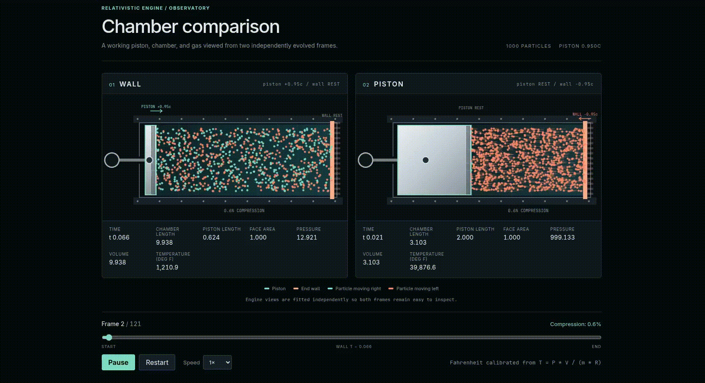

## Relativistic Engine



This project independently evolves a one-dimensional collisionless gas in the
end-wall frame and the post-acceleration piston frame.

At matched piston events, each simulation infers a normalized, apparent
bulk-average ideal-gas temperature from its own simultaneous state:

```text
temperature = pressure * chamber_volume / (trapped_gas_mass * specific_gas_constant)
```

The pressure is the chamber-average longitudinal momentum flux
`sum(particle_momentum * particle_velocity) / chamber_volume`. Because this is
an observer-frame measurement, directed gas motion contributes to the result.

The initial WALL-frame value is calibrated to `70 deg F`. Displayed
temperatures use the same absolute-temperature scale in both frames:

```python
reference_kelvin = fahrenheit_to_kelvin(70.0)
temperature_kelvin = model_temperature / reference_model_temperature * reference_kelvin
temperature_fahrenheit = kelvin_to_fahrenheit(temperature_kelvin)
```

No bulk-motion or proper-temperature correction is applied.

The animation gives the piston a visualization-only proper length of `2.0`.
Its displayed longitudinal length is Lorentz-contracted in frames where the
piston moves. Its face area is unchanged because the boost is parallel to the
cylinder axis. The simulation's collision surface remains the prescribed,
infinitely thin piston boundary.

Run the experiment with:

```shell
uv run python -m relativistic_engine
```

The command also writes `web/public/simulation.json` for the static Vite app.
Install its development dependencies and start the local viewer:

```shell
npm --prefix web install
npm --prefix web run dev
```

The terminal prints the local URL. No application API is required.

Build a deployable static site with:

```shell
npm --prefix web run build
```

The complete site is written to `web/dist/`, including the generated JSON.
